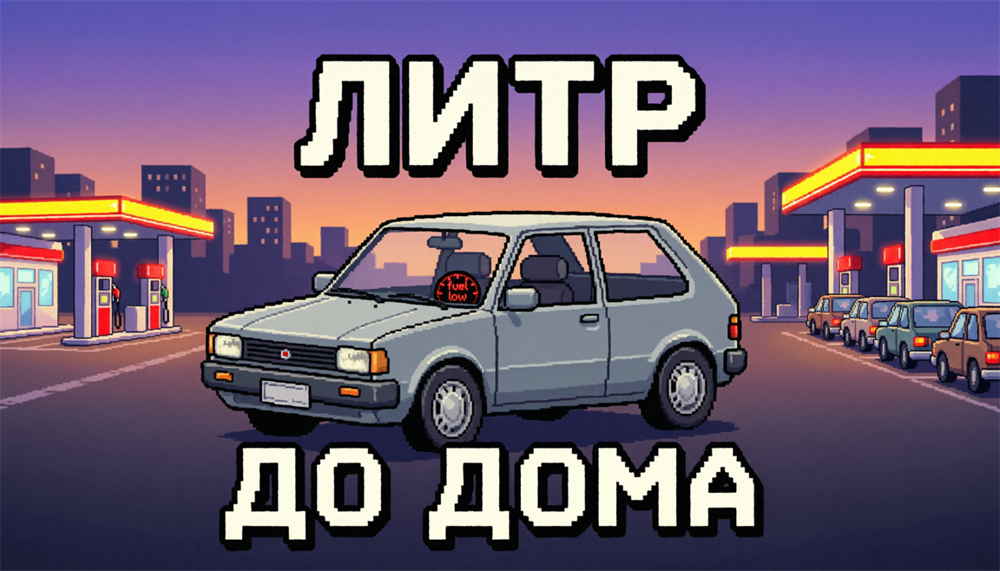

# Литр До Дома: Симулятор Очереди

> Пиксельная городская аркада про топливный кризис в вымышленном Нефтеграде.

Вымышленный город Нефтеград переживает топливный кризис: заправки то закрываются,
то открываются на несколько минут, цены меняются, а очереди растягиваются через
кварталы. Игрок начинает с почти пустым баком и старенькой машиной. Цель — ездить
по районам, искать работающие АЗС, занимать очередь, не тратить остаток топлива
впустую и постепенно прокачивать автомобиль.

Ключевая шутка игры: на карте всё время «ОТКРЫТА ЗАПРАВКА», ты мчишься туда через
весь город — а там очередь из сорока машин, бензин закончился или владелец АЗС
внезапно меняет цену.



## Особенности

- Пиксельная графика в стиле 90-х: 16-цветная палитра, целочисленный масштаб,
  вид сверху и большая карта, камера едет за машиной
- Простое управление одной рукой: виртуальный джойстик, кнопки СТАРТ/СТОП и СИГНАЛ
- Топливо как главный ресурс: расход зависит от скорости, двигателя и веса
- Живые АЗС: цена, очередь, лимит литров, поломка колонки, бензовоз, «пусто»
- Слухи по радио: правда, устаревшая информация и дезинформация
- Городской трафик, пробки и столкновения
- Заказы на доставку (флажки), канистры с топливом на дорогах
- Гараж: несколько автомобилей и восемь улучшений
- Три режима: свободная поездка, выживание (3 литра) и кампания на 7 дней
- Локальный рекорд и сохранение гаража (`shared_preferences`)
- Локализация на русском языке; игра не требует интернета

## Игровой цикл

1. Игрок появляется у дома с ограниченным запасом топлива.
2. На карте видны АЗС и их состояние; радио подсказывает, где что происходит.
3. Нужно выбрать: ехать к ближней АЗС, рискнуть ради дешёвой или искать канистры.
4. По дороге расходуется бензин: скорость, пробки и объезды увеличивают расход.
5. На АЗС игрок встаёт в хвост очереди и ждёт, следя за событиями.
6. У колонки бак заполняется (оплата по литру), после чего можно ехать дальше.
7. Если бак опустел — вызывается эвакуатор (180₽), иначе партия заканчивается.
8. Деньги тратятся на бензин, эвакуатор и улучшения в гараже.

## Режимы

| Режим | Правила |
|---|---|
| Свободная поездка | Полный бак, город открыт, цель — заработать и прокачаться |
| Выживание | Старт с 3 литрами и 180₽: прожить как можно дольше |
| Кампания | 7 дней с целями: заправки, доставки, очередь века и финальный рейс |

## События в очереди

- «БЕНЗИН КОНЧИЛСЯ» — АЗС закрывается на дозавоз
- «БЕНЗОВОЗ В ПУТИ» — скоро завоз, очередь ускоряется
- «НЕ БОЛЕЕ 10 Л В РУКИ» — временный лимит
- «КОЛОНКА СЛОМАЛАСЬ» — заправка встаёт на ремонт
- «ЦЕНА ОБНОВЛЕНА» — цена скачет вверх-вниз
- «ОЧЕРЕДЬ ДВИЖЕТСЯ» / «КТО-ТО ЛЕЗЕТ БЕЗ ОЧЕРЕДИ»

## Технологии

- **Flutter** (Dart 3) — единый код, сборка APK/AAB для Android
- Вся графика рисуется кодом: спрайты-иконки описаны «картой символов»,
  машины, дома, дороги и АЗС — пиксельные примитивы
- 16-цветная палитра, виртуальное разрешение 180 x ~400 и целочисленное
  масштабирование — пиксель всегда квадратный
- Звуки синтезируются кодом (`tool/gen_sounds.dart`), ассеты — только логотип
  и иконка

## Структура проекта

```
lib/
  main.dart                 точка входа, ориентация, тема
  engine/
    game.dart               движок: сцены, топливо, АЗС, очередь, экономика
    city.dart               генерация города, здания, трафик, столкновения
    stations.dart           модель АЗС и очереди
    vehicles.dart           характеристики машин и физика
    upgrades.dart           список улучшений
    sprites.dart            спрайты-иконки «карты символов»
    effects.dart            частицы, всплывающий текст, кольца
    palette.dart            16-цветная палитра
    pixels.dart             пиксельные примитивы
    view_transform.dart     экран -> виртуальные пиксели
    signal.dart             минимальный ChangeNotifier
  ui/
    game_screen.dart        цикл кадров, ввод, слои интерфейса
    pixel_view.dart         отрисовка мира и HUD
    overlays.dart           меню, гараж, итог дня, финал, пауза, кнопки
  services/
    storage.dart            рекорд, гараж и настройки
    sfx.dart                звук и вибрация
tool/
  gen_sounds.dart           генератор 8-bit сэмплов
assets/
  audio/*.wav               сгенерированные звуки
  icon/app_icon.png         иконка приложения
test/
  game_test.dart            тесты игровой логики
build_apk.ps1 / .bat        сборка APK/AAB
```

## Сборка APK

Требуется [Flutter SDK](https://docs.flutter.dev/get-started/install/windows) 3.16+
и Android SDK. Проверка окружения:

```bash
flutter doctor
```

Быстрый старт (Windows, PowerShell):

```powershell
pwsh -File build_apk.ps1 -Icons
```

Двойным щелчком: `build_apk.bat`. Ручная сборка:

```bash
flutter pub get
dart tool/gen_sounds.dart
dart run flutter_launcher_icons
flutter build apk --release          # build/app/outputs/flutter-apk/app-release.apk
```

Установка на устройство:

```bash
adb install -r build/app/outputs/flutter-apk/app-release.apk
```

По умолчанию release-сборка подписывается debug-ключом. Для публикации в RuStore
нужен свой ключ: создайте его флагом `-NewKeystore` и подключите подпись —
пошагово описано в [RUSTORE.md](RUSTORE.md).

## Тесты

```bash
flutter test
```

## Статус проекта

Первый играбельный MVP: город, четыре АЗС, очереди, события, трафик, заказы,
канистры, гараж и три режима. Баланс, визуальный стиль и состав уровней могут
меняться.

Планы: электромобиль и зарядки, больше районов, погода и ночь, кампания с
диалогами, «Очередь века» и «Доставка канистр» как отдельные режимы.

## Лицензия

MIT License — см. [LICENSE](LICENSE).
